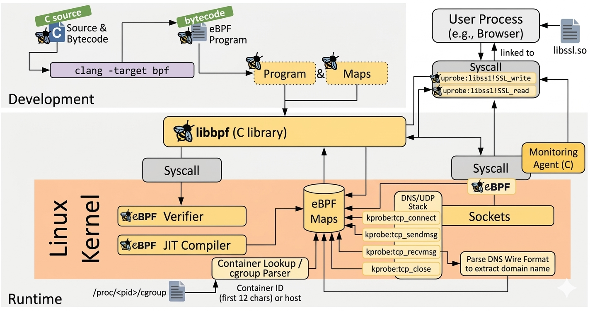
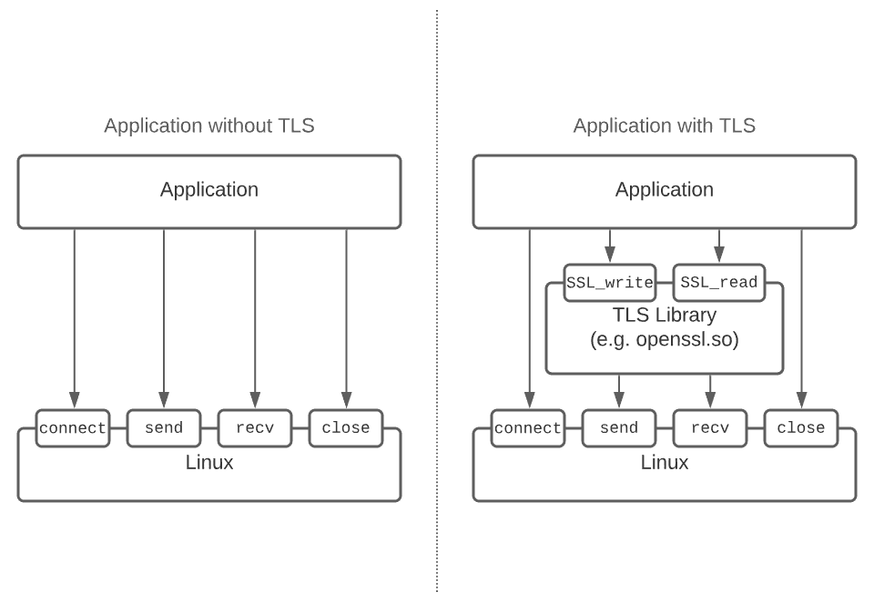
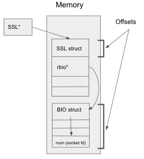

# eBPF-Monitor

A Linux network security visibility tool built with eBPF. It hooks into kernel TCP functions and OpenSSL library calls to monitor connections and intercept TLS plaintext in real time, with minimal overhead.

## What it does

**TCP monitoring** -- kprobes on `tcp_connect`, `tcp_sendmsg`, `tcp_recvmsg`, and `tcp_close` capture every TCP connection lifecycle event per process, including source/destination IPs, ports, byte counts, and process info.

**TLS interception** -- uprobes on `SSL_write` and `SSL_read` (OpenSSL) capture plaintext data before encryption and after decryption. This lets you see what applications are actually sending and receiving over HTTPS without breaking the TLS session.

**DNS monitoring** -- hooks `udp_sendmsg` and filters for port 53 traffic. Parses the DNS wire format to extract the queried domain name, tagged with the process that made the query.

**Container awareness** -- detects if a process runs inside a Docker container by reading `/proc/<pid>/cgroup`. Events are tagged with the short container ID (first 12 chars) or `host` for non-containerized processes.

**JSON export** -- writes all events as JSON lines to a file. Each line includes timestamp, PID, process name, container ID, network tuple, event type, and optionally a TLS plaintext preview or DNS domain name. Suitable for SIEM ingestion or ML training pipelines.

**TUI mode** -- interactive ncurses terminal UI with color-coded event types, live event counter, active connection count, and keyboard controls for pause/resume and filtering.

```
TIME      COMM              PID     CONTAINER      SRC                    DST                    BYTES       TYPE
--------  ----------------  ------  -------------  ---------------------  ---------------------  ----------  -------
14:57:52  curl              2922242 host           192.168.1.10:49416     104.18.26.120:443      0           CONNECT
14:57:52  curl              2922242 host           192.168.1.10:49416     104.18.26.120:443      630         OUTBOUND
TLS  curl              2922242  OUTBOUND    24 bytes  PRI * HTTP/2.0....SM....
TLS  curl              2922242  INBOUND   537 bytes  ...<!doctype html><html lang="en"><head><title>Example Domain</title>...
14:57:53  curl              2922242 host           192.168.1.10:49416     104.18.26.120:443      0           CLOSE
14:28:09  dig               2825601 host           192.168.1.10:42331     8.8.8.8:53                         DNS_QUERY google.com
14:28:12  nginx             38421   a1b2c3d4e5f6   172.17.0.2:80          192.168.1.10:54210     2048        OUTBOUND
```

## Architecture



```
 KERNEL SPACE (eBPF)                        USERSPACE (C + libbpf)
+-----------------------------------+      +---------------------------+
| tcp_monitor.bpf.c                 |      | main.c                    |
|   kprobe/tcp_connect              |      |   Load BPF skeletons      |
|   kprobe/tcp_sendmsg              | ---> |   Attach kprobes/uprobes  |
|   kprobe/tcp_recvmsg              | perf |   Poll perf buffers       |
|   kprobe/tcp_close                | buf  |   Resolve container IDs   |
|   kprobe/udp_sendmsg (port 53)    |      |   Parse DNS wire format   |
+-----------------------------------+      +---------------------------+
| tls_intercept.bpf.c              |      |                           |
|   uprobe/SSL_write   (entry)     | ---> |   Cache TLS plaintext     |
|   uprobe/SSL_read    (entry)     | perf |   Correlate with TCP      |
|   uretprobe/SSL_read (return)    | buf  |   Export JSON / TUI       |
+-----------------------------------+      +---------------------------+
```

The TLS perf buffer is polled before the TCP buffer each cycle. This matters because `SSL_write` fires before `tcp_sendmsg` in the kernel call chain -- so the plaintext preview is cached before the matching TCP OUTBOUND event arrives.

## Requirements

- Linux kernel 5.15+ with BPF, kprobe, and uprobe support
- x86-64 architecture
- Root privileges (or `CAP_SYS_ADMIN` + `CAP_PERFMON`)
- OpenSSL `libssl.so` installed (for TLS interception)
- Docker (for container awareness)

Tested on Ubuntu Server 22.04 LTS (kernel 5.15). Ubuntu Server is a good fit for this tool since most server-side services (Apache, nginx, curl, Python) dynamically link against the system `libssl.so`, making their TLS traffic visible to the uprobes out of the box.

### Build dependencies (Ubuntu/Debian)

```bash
sudo apt install -y clang llvm libelf-dev libbpf-dev \
    linux-tools-$(uname -r) linux-tools-common \
    gcc-multilib make pkg-config libncurses-dev
```

## Building

Generate the kernel type header (one-time, or after kernel updates):

```bash
bpftool btf dump file /sys/kernel/btf/vmlinux format c > src/vmlinux.h
```

Build:

```bash
make
```

This compiles the BPF programs with `clang`, generates skeleton headers with `bpftool`, and links the userspace binary with `gcc`.

## Usage

```bash
# Basic -- see all TCP, TLS, and DNS events
sudo ./ebpf-netsec

# Filter out noisy processes
sudo ./ebpf-netsec --exclude sshd --exclude ovsdb-server --exclude python3

# Show only specific event types
sudo ./ebpf-netsec --type OUTBOUND --type INBOUND

# Interactive TUI
sudo ./ebpf-netsec --tui

# Export to JSON lines
sudo ./ebpf-netsec --exclude sshd --export capture.jsonl

# Combine flags
sudo ./ebpf-netsec --exclude sshd --export capture.jsonl --tui
```

Available types: `CONNECT`, `OUTBOUND`, `INBOUND`, `CLOSE`.

### TUI mode

The `--tui` flag gives you a live-updating ncurses interface with color-coded event types:

- Blue = CONNECT
- Green = OUTBOUND
- Yellow = INBOUND
- Red = CLOSE
- Magenta = DNS_QUERY

Keys: `q` quit, `p` pause/resume, `f` cycle filter (all / outbound only / inbound only).

### JSON export

Each line is a self-contained JSON object:

```json
{"timestamp":"2026-03-29T14:29:03Z","pid":2825556,"comm":"curl","container_id":"host","src_ip":"192.168.1.10","src_port":57146,"dst_ip":"104.18.26.120","dst_port":443,"bytes":73,"event_type":"OUTBOUND","plaintext_preview":"GET / HTTP/1.1\r\nHost: example.com\r\nUser-Agent: curl/7.88.1\r\n"}
```

DNS events include a `domain` field:

```json
{"timestamp":"2026-03-29T14:30:12Z","pid":2825601,"comm":"dig","container_id":"host","src_ip":"192.168.1.10","src_port":42331,"dst_ip":"8.8.8.8","dst_port":53,"bytes":0,"event_type":"DNS_QUERY","domain":"google.com"}
```

## How TLS interception works

Without TLS, applications talk directly to the kernel's TCP stack. With TLS, an OpenSSL library sits between the application and the kernel -- and that's where the tool hooks in:



The tool automatically discovers the system `libssl.so` and resolves `SSL_write` / `SSL_read` symbol offsets at startup. It uses the SSL struct's memory layout to locate the right function addresses:



It then attaches uprobes to those functions:

- **`SSL_write`** -- a uprobe at entry reads the plaintext buffer before OpenSSL encrypts it.
- **`SSL_read`** -- a uprobe at entry saves the buffer pointer; a uretprobe at return reads the now-filled plaintext after OpenSSL decrypts it.

The interception happens inside the process's address space at the OpenSSL API boundary. No MITM proxy, no certificate manipulation. The wire data stays encrypted.

## Container awareness

The tool reads `/proc/<pid>/cgroup` for each event and looks for Docker cgroup patterns (`/docker/<id>` or `docker-<id>`). If found, the first 12 characters of the container ID are shown in the CONTAINER column. Otherwise it shows `host`.

Container IDs are cached per PID to avoid repeated filesystem reads. The cache is evicted on CLOSE events.

To test with Docker:

```bash
sudo docker run -d --name test-nginx -p 8080:80 nginx
curl http://localhost:8080
# nginx traffic will be tagged with the container ID
```
## Project structure

```
src/
  vmlinux.h              Kernel type definitions (generated by bpftool)
  tcp_monitor.bpf.c      eBPF program: TCP + DNS monitoring (5 kprobes)
  tcp_monitor.h          Shared tcp_event struct
  tls_intercept.bpf.c    eBPF program: TLS plaintext interception (3 uprobes)
  tls_intercept.h        Shared tls_event struct
  main.c                 Userspace: loader, event handler, TUI, JSON export
docs/
  images/                Architecture diagrams and screenshots
Makefile                 Build configuration
```